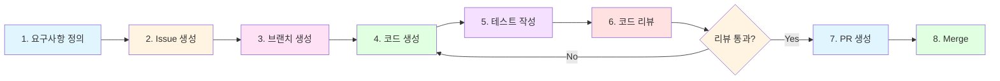

# 9. 전체 개발 사이클 실습 (Full Cycle Practice)

## 학습 목표
- 요구사항 정의부터 Merge까지 전체 개발 사이클을 Copilot과 함께 경험
- 1~8단계에서 학습한 내용을 하나의 흐름으로 통합 실습
- 실무와 동일한 GitHub 기반 워크플로우 체득

---

## 교육 내용

### 9.1 전체 개발 사이클 개요

1~8단계에서 학습한 각 기법을 **하나의 기능 개발 과정**에서 연속적으로 적용합니다.

```
요구사항 정의 → Issue 생성 → 브랜치 생성 → 코드 생성 → 테스트 작성 → 코드 리뷰 → PR 생성 → Merge
```



### 9.2 실습 시나리오: "상품 카테고리 검색 기능 추가"

전체 사이클 실습을 위한 시나리오입니다.

> **요구사항:** Product Service에 카테고리별 상품 검색 기능을 추가한다.
> - `GET /api/products/category/{categoryName}` 엔드포인트 추가
> - Product 엔티티에 `category` 필드 추가
> - 카테고리가 없는 경우 빈 목록 반환
> - 단위 테스트 및 통합 테스트 작성

---

### Step 1. 요구사항 정의 (1단계 활용)

Copilot에게 요구사항을 구체화하도록 요청합니다.

#### Copilot 프롬프트

```
다음 요구사항을 분석하고 상세 명세를 작성해주세요:

기능: Product Service에 카테고리별 상품 검색 기능 추가
- 새로운 API 엔드포인트: GET /api/products/category/{categoryName}
- Product 엔티티에 category 필드 추가
- 기존 API에 영향 없어야 함

다음을 포함해주세요:
1. API 스펙 (요청/응답 형식)
2. 필요한 코드 변경 범위
3. 엣지 케이스 정리
```

#### 기대 결과

- API 요청/응답 형식 정의
- 변경이 필요한 파일 목록 파악
- 엣지 케이스: 카테고리 미존재, 빈 문자열, 대소문자 처리 등

---

### Step 2. Issue 생성 (GitHub 워크플로우)

요구사항을 기반으로 GitHub Issue를 작성합니다.

#### Copilot 프롬프트

```
다음 요구사항으로 GitHub Issue를 작성해주세요:

기능: Product Service 카테고리별 상품 검색 기능

포함할 내용:
- 제목
- 설명 (배경, 요구사항, 기술적 고려사항)
- 수용 기준 (Acceptance Criteria)
- 체크리스트 (구현 항목)
```

#### Issue 작성 예시

```markdown
## 제목
[Feature] Product Service - 카테고리별 상품 검색 기능 추가

## 설명
Product Service에 카테고리 기반 상품 검색 기능을 추가합니다.

### 요구사항
- Product 엔티티에 category 필드 추가
- 카테고리별 상품 목록 조회 API 구현
- 기존 API와 하위 호환성 유지

### 수용 기준
- [ ] GET /api/products/category/{categoryName} 호출 시 해당 카테고리 상품 목록 반환
- [ ] 존재하지 않는 카테고리 조회 시 빈 목록 반환
- [ ] 단위 테스트 통과
- [ ] 기존 테스트 영향 없음

### 체크리스트
- [ ] Product 엔티티 수정
- [ ] ProductRepository 메서드 추가
- [ ] ProductService 메서드 추가
- [ ] ProductController 엔드포인트 추가
- [ ] 단위 테스트 작성
- [ ] 통합 테스트 작성
```

---

### Step 3. 브랜치 생성

Issue 번호를 기반으로 feature 브랜치를 생성합니다.

```bash
# 브랜치 명명 규칙: feature/이슈번호-간단설명
git checkout -b feature/issue-42-product-category-search
```

---

### Step 4. 코드 생성 (2~5단계 활용)

Copilot을 활용하여 코드를 생성합니다. **3S 원칙(Simple, Specific, Structured)**을 적용합니다.

#### 4-1. 엔티티 수정

```
Product 엔티티에 category 필드를 추가해주세요.

현재 프로젝트 정보:
- Java 17, Spring Boot 3.2
- Lombok 사용 (@Data, @Builder)
- JPA 엔티티 (@Entity)

요구사항:
- category: String 타입, nullable
- 기존 필드에 영향 없이 추가
```

#### 4-2. Repository 메서드 추가

```
ProductRepository에 카테고리별 상품 조회 메서드를 추가해주세요.

현재 구조:
- Spring Data JPA의 JpaRepository 상속
- 엔티티: Product (id, name, price, stock, category)

요구사항:
- 카테고리명으로 상품 목록 조회
- Spring Data JPA 쿼리 메서드 네이밍 규칙 사용
```

#### 4-3. Service 메서드 추가

```
ProductService에 카테고리별 상품 조회 메서드를 추가해주세요.

기존 코드 스타일:
- @Service, @Transactional 사용
- 반환 타입: List<ProductResponse>
- ApiResponse 래퍼 사용하지 않음 (Controller에서 처리)

요구사항:
- findByCategory(String categoryName) 메서드
- 카테고리가 없으면 빈 목록 반환
- Entity → DTO 변환 포함
```

#### 4-4. Controller 엔드포인트 추가

```
ProductController에 카테고리별 상품 조회 엔드포인트를 추가해주세요.

기존 코드 스타일:
- @RestController, @RequestMapping("/api/products")
- 응답: ApiResponse<T> 래퍼 클래스 사용
- HTTP 상태 코드 적절히 사용

요구사항:
- GET /api/products/category/{categoryName}
- 성공 시 200 OK + 상품 목록
- 빈 목록도 200 OK (빈 배열)
```

#### 코드 수용 시 확인사항 (Pre-Course 내용 적용)

생성된 코드를 수용하기 전 반드시 확인:

- [ ] 존재하지 않는 메서드/클래스가 없는가? (Hallucination 체크)
- [ ] Spring Boot 3.2 / Java 17 기준 deprecated API가 없는가?
- [ ] 예외 처리가 적절한가?
- [ ] 기존 코드 스타일과 일관성이 있는가?

---

### Step 5. 테스트 작성 (7단계 활용)

#### 5-1. 단위 테스트

```
ProductService.findByCategory() 메서드의 단위 테스트를 작성해주세요.

테스트 가이드:
- JUnit 5 + Mockito 사용
- 메서드명: should_기대결과_when_조건 형식
- ProductRepository는 Mock 처리

테스트 케이스:
1. 카테고리에 상품이 있는 경우 → 목록 반환
2. 카테고리에 상품이 없는 경우 → 빈 목록 반환
3. null 카테고리 전달 시 → 빈 목록 반환 또는 예외
```

#### 5-2. 통합 테스트

```
카테고리별 상품 조회 API의 통합 테스트를 작성해주세요.

테스트 가이드:
- @SpringBootTest + @AutoConfigureMockMvc
- H2 In-Memory DB 사용
- 테스트 데이터 setup → API 호출 → 응답 검증

테스트 케이스:
1. 카테고리별 조회 성공
2. 존재하지 않는 카테고리 조회 시 빈 목록
```

#### 테스트 실행

```bash
# 단위 테스트 실행
./gradlew :product-service:test

# 특정 테스트 클래스만 실행
./gradlew :product-service:test --tests "*.ProductServiceTest"
```

---

### Step 6. 코드 리뷰 (6단계 활용)

코드 생성 및 테스트 통과 후, Copilot을 활용하여 셀프 리뷰를 진행합니다.

#### Copilot 프롬프트

```
다음 변경사항을 코드 리뷰해주세요.

리뷰 관점:
1. 정확성: 비즈니스 로직이 올바른가?
2. 보안: SQL Injection, XSS 등 취약점은 없는가?
3. 성능: N+1 쿼리, 불필요한 DB 호출은 없는가?
4. 유지보수성: 코드 가독성, 네이밍, 중복 코드는 없는가?
5. MSA 관점: 다른 서비스에 영향을 주는 변경은 없는가?

[변경된 파일 목록 또는 코드 첨부]
```

#### 리뷰 체크리스트

| 항목 | 확인 |
|------|------|
| API 스펙이 요구사항과 일치하는가? | |
| 기존 API에 영향이 없는가? | |
| 예외 처리가 적절한가? | |
| 테스트 커버리지가 충분한가? | |
| 코딩 컨벤션을 준수하는가? | |
| Copilot Instruction 규칙을 따르는가? | |

---

### Step 7. PR 생성

리뷰를 통과한 코드를 Pull Request로 생성합니다.

#### Copilot 프롬프트

```
다음 변경사항으로 Pull Request 본문을 작성해주세요.

관련 Issue: #42
변경 내용:
- Product 엔티티에 category 필드 추가
- 카테고리별 상품 조회 API 구현
- 단위 테스트 및 통합 테스트 추가

PR 템플릿 형식으로 작성:
- 변경 사항 요약
- 변경 유형 (기능 추가)
- 테스트 방법
- 체크리스트
```

#### Git 커밋 및 PR

```bash
# 변경사항 커밋 (의미 있는 커밋 메시지)
git add .
git commit -m "feat(product): 카테고리별 상품 검색 기능 추가

- Product 엔티티에 category 필드 추가
- GET /api/products/category/{categoryName} 엔드포인트 구현
- 단위 테스트 및 통합 테스트 작성

Closes #42"

# 원격 브랜치 푸시
git push origin feature/issue-42-product-category-search

# GitHub에서 PR 생성
```

#### PR 본문 예시

```markdown
## 변경 사항
Product Service에 카테고리별 상품 검색 기능을 추가합니다.

### 변경 유형
- [x] 새로운 기능 (Feature)

### 변경 파일
| 파일 | 변경 내용 |
|------|----------|
| Product.java | category 필드 추가 |
| ProductRepository.java | findByCategory() 메서드 추가 |
| ProductService.java | findByCategory() 비즈니스 로직 |
| ProductController.java | GET /category/{name} 엔드포인트 |
| ProductServiceTest.java | 단위 테스트 3개 |
| ProductIntegrationTest.java | 통합 테스트 2개 |

### 테스트 방법
```bash
./gradlew :product-service:test
```

### 체크리스트
- [x] 코드가 정상적으로 빌드됨
- [x] 단위 테스트 통과
- [x] 통합 테스트 통과
- [x] 기존 테스트 영향 없음
- [x] 코딩 컨벤션 준수
- [x] API 문서 업데이트 (필요시)

Closes #42
```

---

### Step 8. Merge

PR이 승인되면 Merge를 진행합니다.

#### Merge 전 최종 확인

```bash
# main 브랜치 최신 상태 동기화
git checkout main
git pull origin main

# feature 브랜치에 main 반영 (충돌 확인)
git checkout feature/issue-42-product-category-search
git rebase main

# 충돌 해결 후 테스트 재실행
./gradlew :product-service:test
```

#### Merge 전략

| 전략 | 설명 | 사용 시점 |
|------|------|----------|
| Merge Commit | 모든 커밋 이력 보존 | 복잡한 기능, 이력 추적 필요 |
| Squash Merge | 하나의 커밋으로 압축 | 작은 기능, 깔끔한 이력 선호 |
| Rebase Merge | 선형 이력 유지 | 커밋별 이력이 중요할 때 |

```bash
# GitHub에서 Squash and Merge 권장 (작은 기능의 경우)
# Merge 후 브랜치 삭제
git branch -d feature/issue-42-product-category-search
git push origin --delete feature/issue-42-product-category-search
```

---

## 전체 사이클 요약 (한눈에 보기)

| 단계 | 활동 | Copilot 활용 | 관련 교육 단계 |
|------|------|-------------|---------------|
| 요구사항 정의 | 기능 명세 작성 | 요구사항 분석 및 상세화 | 1단계 |
| Issue 생성 | GitHub Issue 작성 | Issue 템플릿 생성 | - |
| 브랜치 생성 | Feature 브랜치 생성 | - | - |
| 코드 생성 | Entity → Repository → Service → Controller | 3S 원칙 기반 코드 생성 | 2~5단계 |
| 테스트 작성 | 단위 테스트 + 통합 테스트 | 테스트 케이스 자동 생성 | 7단계 |
| 코드 리뷰 | 셀프 리뷰 + 피어 리뷰 | AI 코드 리뷰 | 6단계 |
| PR 생성 | PR 본문 작성 | PR 템플릿 자동 생성 | - |
| Merge | 최종 반영 | 충돌 해결 지원 | 8단계 |

---

## 실습

### 실습 1: 전체 사이클 실습 (카테고리 검색)

위 시나리오를 처음부터 끝까지 직접 수행해보세요:
1. Copilot으로 요구사항 분석
2. GitHub Issue 작성
3. Feature 브랜치 생성
4. Copilot으로 코드 생성 (Entity → Repository → Service → Controller)
5. Copilot으로 테스트 작성 및 실행
6. Copilot으로 코드 리뷰
7. PR 작성 및 Merge

### 실습 2: 자유 기능 추가 (응용)

아래 중 하나를 선택하여 동일한 전체 사이클을 수행해보세요:

| 기능 | 설명 |
|------|------|
| 주문 상태 필터 조회 | `GET /api/orders?status=PENDING` - 주문 상태별 필터링 |
| 사용자 이름 검색 | `GET /api/users/search?name=홍길동` - 이름으로 사용자 검색 |
| 상품 가격 범위 조회 | `GET /api/products/price?min=10000&max=50000` - 가격 범위 필터링 |

---

## 핵심 포인트

1. **전체 흐름 체득**: 요구사항 → 코드 → 테스트 → 리뷰 → Merge의 완전한 사이클 경험
2. **Copilot은 모든 단계에서 활용 가능**: 요구사항 분석부터 PR 작성까지
3. **검증은 사람의 몫**: Copilot이 생성한 모든 산출물은 반드시 검증 후 수용
4. **Git 워크플로우 습관화**: Issue → Branch → Commit → PR → Merge 흐름 체득
5. **반복 학습**: 여러 기능으로 사이클을 반복할수록 Copilot 활용 능력 향상
